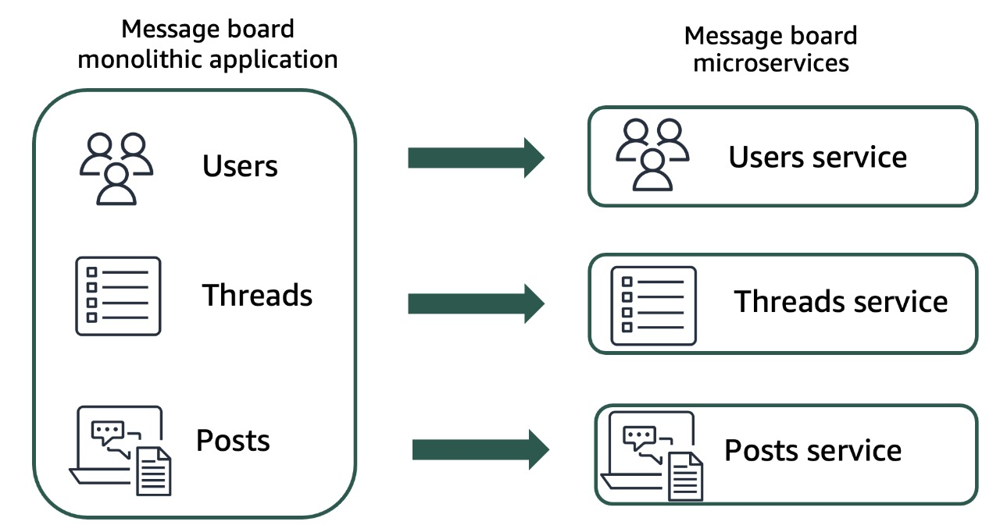
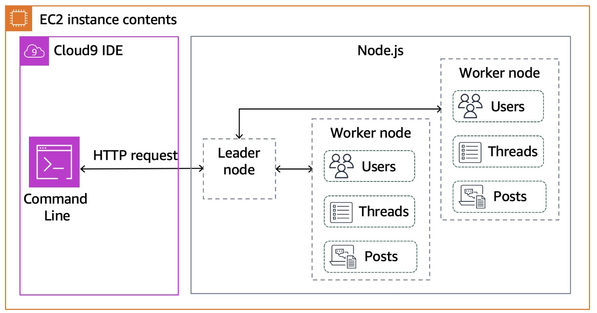
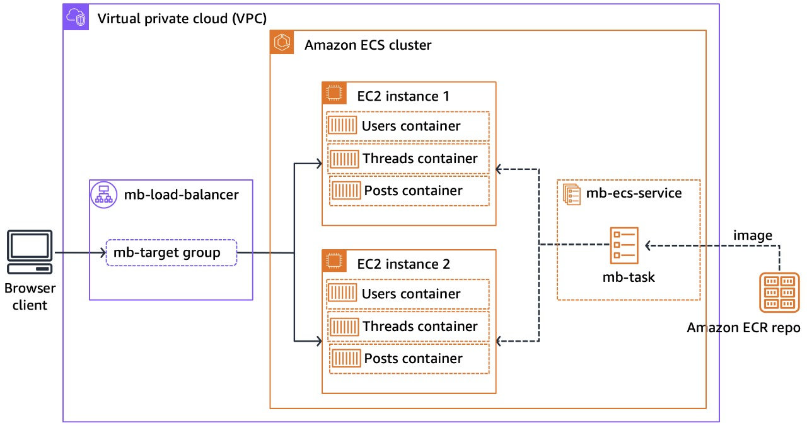
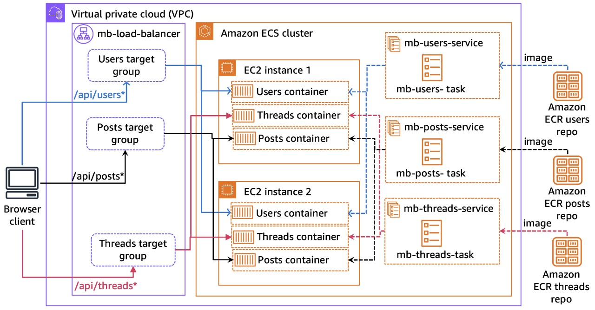

# AWS Monolith to Microservices Refactor

A detailed project demonstrating the architectural migration of a Node.js application from a traditional on-server monolith to a containerized, microservices-based deployment on Amazon Web Services.

## Project Overview

This repository documents a hands-on project focused on modernizing a legacy application. The primary goal is to showcase a realistic, step-by-step cloud migration and refactoring strategy. We begin with a simple Node.js message board application and evolve it into a resilient, scalable, and independently deployable set of microservices orchestrated by AWS ECS.

This process highlights critical DevOps and Cloud Engineering principles, including containerization, infrastructure management, and cloud-native design patterns.

**Conceptual Architecture Shift:**

## The Architectural Journey

The project progressed through three key stages, each representing a step towards a modern, cloud-native application.

## Stage 1: The Original On-Server Monolith

The application's starting point. A standard Node.js application running directly on a server (e.g., an EC2 instance). It uses the built-in Node.js `cluster` module to manage concurrent requests.

* **Pros:** Simple to develop and debug locally.
* **Cons:** Difficult to scale, a single bug can crash the entire application, and deployments often require downtime.

## Stage 2: The Containerized Monolith on AWS

The "Lift and Shift" phase. The entire monolithic application is packaged into a **Docker** container, decoupling it from the host OS. It is then deployed to an **Amazon ECS** cluster, with an **Application Load Balancer (ALB)** distributing traffic for improved reliability.

* **Pros:** Improved portability and consistent environments.
* **Cons:** Still a monolith; scaling deploys the entire application, and the codebase remains tightly-coupled.

## Stage 3: The Microservices Architecture on AWS

The final, modernized architecture. The monolith is broken down into independent services (**Users**, **Threads**, and **Posts**). Each service is in its own Docker container and deployed as a separate ECS Service. The ALB is configured with **path-based routing** to intelligently send requests to the correct service.

* **Pros:** Services can be scaled, updated, and deployed independently. Fosters team autonomy and resilience.
* **Cons:** Increased operational complexity in networking and monitoring.

## Technology Stack

* **Backend:** Node.js, Koa.js
* **Containerization:** Docker
* **Cloud Provider:** Amazon Web Services (AWS)
    * **Container Orchestration:** Amazon Elastic Container Service (ECS)
    * **Container Registry:** Amazon Elastic Container Registry (ECR)
    * **Networking:** Application Load Balancer (ALB), VPC
    * **Compute:** EC2

## Key Learnings & Skills Demonstrated

* **Architectural Design:** Understanding the trade-offs between monolithic and microservices architectures.
* **Containerization:** Proficiency with Docker for creating portable, isolated application environments.
* **Cloud Orchestration:** Hands-on experience with AWS ECS for deploying, managing, and scaling containerized applications.
* **Cloud Networking:** Configuring AWS Application Load Balancers for intelligent, path-based routing.
* **DevOps Principles:** Implementing a **"lift and shift"** migration followed by a **"refactor"** modernization, demonstrating a common DevOps workflow.